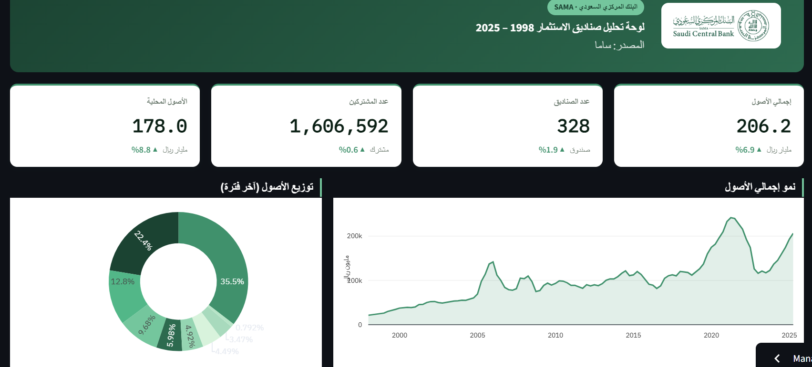
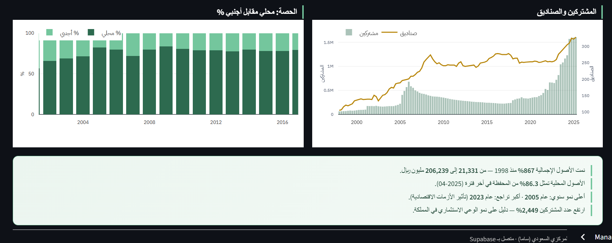

# SAMA Investment Funds Dashboard

An interactive dashboard analyzing Saudi Arabia's investment fund sector from 1998 to 2025, built using data from the Saudi Central Bank (SAMA).

**Live Dashboard:** [Click here](https://financial-dashboard-project-vey6dsvue9vnprsrshfsms.streamlit.app/)

---

## Project Overview

This project explores the growth and structure of investment funds in Saudi Arabia over 27 years. The dashboard answers key questions such as:
- How have total assets grown since 1998?
- What is the split between local and foreign assets?
- How has the number of funds and subscribers changed over time?

---

## Data Source

- **Source:** Saudi Central Bank (SAMA) — [Investment Funds Reports](https://www.sama.gov.sa/ar-sa/EconomicReports/Pages/report.aspx?cid=120)
- **Coverage:** 1998 – 2025 (quarterly data)
- **Records:** 110 rows after cleaning
- **Format:** CSV → cleaned and uploaded to Supabase (PostgreSQL)

---

## Steps & Methodology

### 1. Data Cleaning
- Removed null rows and duplicate entries
- Standardized column names (English, snake_case)
- Converted date formats to `YYYY-MM-DD`
- Fixed numeric formatting (removed commas, converted to float)
- File: `Dataset/data_cleaning.ipynb`

### 2. Database & SQL
I used SQL to create structured Views on top of the raw data in Supabase, so each chart queries only the data it needs instead of loading everything at once.

- `v_assets_trend` — total assets over time
- `v_yoy_growth` — average assets grouped by year
- `v_asset_composition` — latest period asset breakdown by type
- `v_funds_subscribers` — funds and subscribers count over time
- `v_local_foreign_share` — local vs foreign % per year

Full SQL file: `sama_SQL_analytics.sql`

### 3. Dashboard Development
- Built with **Python + Streamlit**
- Charts built with **Plotly**
- Data fetched live from Supabase via REST API
- Arabic RTL layout with SAMA brand colors
- File: `main_code.py`

### 4. UI/UX Design
- Wireframes designed in **Figma** before development
- Screenshots in `Design files/` folder

---

## Dashboard Screenshots

### KPIs

### Charts

### Insights

---

## UI/UX Design (Figma)

### Overview Page

### Detailed Analysis Page

---

## Key Insights

- Total assets grew **867%** from 1998 to 2025 (21,331 → 206,239 million SAR)
- Local assets represent **86.3%** of the portfolio as of Q2 2025
- Highest annual growth recorded in **2005**, sharpest decline in **2023**
- Number of subscribers increased by **2,449%** — reflecting growing investment awareness
- General upward trend despite correction periods in 2008, 2016, and 2020–2023

---

## Live Dashboard

🔗 [https://financial-dashboard-project-vey6dsvue9vnprsrshfsms.streamlit.app/](https://financial-dashboard-project-vey6dsvue9vnprsrshfsms.streamlit.app/)

---

## Assumptions & Limitations

- All monetary values are in **millions of Saudi Riyals (SAR)**
- Data is sourced directly from SAMA's published statistics
- Some early periods (1998–2000) have limited data points
- Dashboard auto-refreshes data from Supabase every 5 minutes

---

## Tech Stack

| Tool | Purpose |
|------|---------|
| Python | Core programming language |
| Streamlit | Dashboard framework |
| Plotly | Interactive charts |
| Supabase | PostgreSQL cloud database |
| SQL Views | Data aggregation layer |
| Figma | UI/UX wireframing |
| GitHub | Version control & deployment |

---

**Author:** Lujain Fallatah  
**Date:** February 22, 2026
